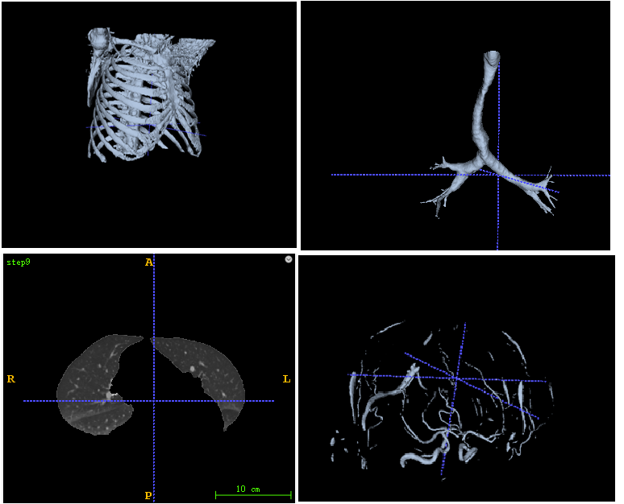

# MedicalImageProcessExample
> There are some examples of 3D Medical Image Process

## How to Use
* i have implemented image process examples with SimpleITK and ITK，including bone segmentation,lung segmentation,tracheal segmentation,vascular segmentation
* test data and intermediate results download here:https://pan.baidu.com/s/1caOdrgmtBkbSCQvM7Y0t6Q password：j6s6

## Result

 

## Contact
* https://github.com/junqiangchen
* email: 1207173174@qq.com
* WeChat Public number: 最新医学影像技术